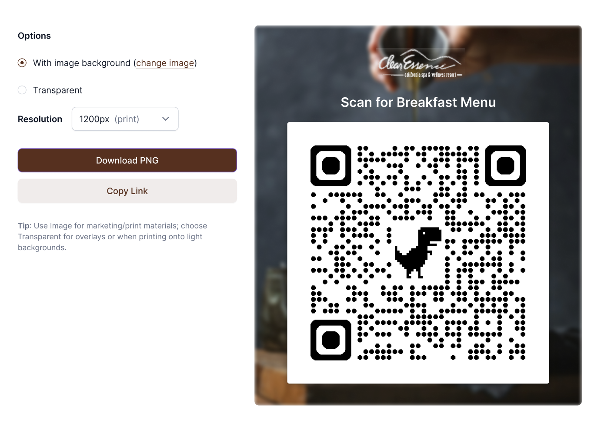

<div align="center">
<h1>Clear Essence Application</h1>
<h6><i>Manage your Guest with Clear Essence</i></h6>
<hr />
</div>

Clear Essence Hotel & Spa seeks to digitize its restaurant and spa menus using QR codes. Guests should be able to scan QR codes placed at the hotel and spa to instantly access menus or service lists on their mobile devices.

# 🏗️ Tech Stack

- **Framework**: [Next.js 15.5.4](https://nextjs.org/) with App Router
- **Styling**: [Tailwind CSS 4](https://tailwindcss.com/)
- **React TanStack Query**: [React Tanstack Query](https://tanstack.com/query/latest)
- **Framer Motion**: [Framer Motion](https://motion.dev/docs)
- **React-Hook Form**: [Redux Hook Form](https://react-hook-form.com)
- **React-Redux**: [Redux Toolkit](https://redux-toolkit.js.org/)
- **Icons**: [Lucide React](https://lucide.dev/)
- **Database**: [Mongodb Database](https://account.mongodb.com/) [Prisma ORM](https://www.prisma.io/)

# 🎯 Prototype



# 🚀 How to Contribute

### 1. Clone the Repository

```bash
git clone -b development https://github.com/TezzaSol/clear-essence-frontend.git
cd clear-essence-frontend
```

### 2. Install Dependencies

```bash
npm install
```

### 3. Environment Setup

Create a `.env` file in the project root:

```env
# Site Information (Optional)
NEXT_PUBLIC_API_BASE_URL=https://clear-essence-backend.onrender.com/api/v1 (staging)
NEXT_PUBLIC_APP_URL=https://staging.menu.tezzasolutions.com (staging)
NEXT_PUBLIC_ENVIRONMENT=development
NODE_ENV="development"
```

### 4. Start Development Server

```bash
yarn dev
```

Visit [http://localhost:3000](http://localhost:3000) to see your application running!

# Deployment

- [GODADDY](https://www.godaddy.com/)
  :Used for domain registration and DNS management, providing a reliable foundation for custom domain configuration.
- [PM2](https://pm2.keymetrics.io/)
  :Used as a process manager for running and monitoring the Node.js backend, enabling zero-downtime restarts and enhanced stability.
- [CONTABO](https://contabo.com/)
  :Used as the VPS hosting provider for deploying the backend and associated microservices.
- [DOCKER](https://www.docker.com/)
  :Used for containerizing the application, ensuring consistent environments across development, staging, and production deployments.
- [NGINX](https://nginx.org/)
  :Used as a reverse proxy and load balancer, managing HTTP requests, SSL termination, and optimizing performance for both frontend and backend services.

# License

The MIT License - Copyright (c) 2025 - Present, tezzaSolutions / Storage Service.


## 🙏 Acknowledgments

- [Next.js](https://nextjs.org) for Frontend
- [NestJs](https://nestjs.com/) for backend services
- [Tailwind CSS](https://tailwindcss.com)
- [Lucide](https://lucide.dev) for icons

## Built by

- [Rasheed Olatunde](https://github.com/geodevcodes) (Software Developer)
- [Steve Chude](https://github.com/stevechude) (Software Developer)
